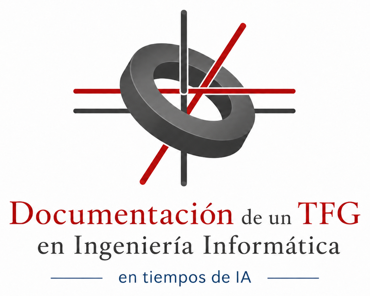

<div align="center">
  

  <h1>Documentación de un TFG en Ingeniería Informática en tiempos de IA</h1>

  <p>
    Libro electrónico vivo, no oficial, opinionated y práctico para preparar la documentación de un
    Trabajo de Fin de Grado en Ingeniería Informática en la Universidad de Salamanca.
  </p>

  <p>
    <a href="https://elloza.com/tfg-grado-ing-informatica/">Web</a> ·
    <a href="https://elloza.com/tfg-grado-ing-informatica/es/intro.html">Leer en español</a> ·
    <a href="https://elloza.com/tfg-grado-ing-informatica/_static/teachbook_es.pdf">PDF</a> ·
    <a href="https://github.com/elloza/tfg-grado-ing-informatica/discussions">Discusiones</a>
  </p>

  <p>
    <a href="https://github.com/elloza/tfg-grado-ing-informatica/actions/workflows/deploy.yml">
      
    </a>
    <a href="https://creativecommons.org/licenses/by/4.0/">
      
    </a>
    
    
  </p>
</div>

## Qué es

Este repositorio contiene un libro electrónico sobre cómo documentar hoy un TFG en Ingeniería Informática en la USAL, con una mirada práctica y centrada en herramientas actuales: gestores bibliográficos, Word/OneDrive, LaTeX/Overleaf, VS Code, diagramas como código, control de versiones y asistentes de inteligencia artificial.

El libro no sustituye a la normativa oficial de la Universidad de Salamanca, de la Facultad de Ciencias ni del Departamento de Informática y Automática. Si hay conflicto entre esta guía y una fuente oficial, prevalecen siempre la normativa vigente y el criterio del tutor, la comisión o el tribunal.

## Autoría

- Autor: **Álvaro Lozano Murciego**
- Año: **2026**
- Licencia del texto original: **Creative Commons Attribution 4.0 International (CC BY 4.0)**
- Proyecto: documento vivo con comentarios mediante GitHub Discussions y Giscus.

## Contenidos

El libro está organizado alrededor de las partes que un estudiante suele necesitar mientras prepara su memoria:

- Normativa del TFG: USAL, Facultad, Departamento y relación con normativa profesional.
- Documentación del TFG: estilo, citas, estructura actual, correspondencias con modelos antiguos, memoria y anexos.
- Ingeniería del software aplicada al TFG: metodologías, UML como código y planificación.
- Herramientas: Word, LaTeX/Overleaf, VS Code, agentes de código e IA.
- Errores comunes y FAQ.
- Presentación y defensa.
- Créditos, licencias, cómo citar y bibliografía.

## Web y PDF

La versión publicada está disponible en:

- Web principal: <https://elloza.com/tfg-grado-ing-informatica/>
- GitHub Pages: <https://elloza.github.io/tfg-grado-ing-informatica/>
- PDF en español: <https://elloza.com/tfg-grado-ing-informatica/_static/teachbook_es.pdf>
- PDF en inglés: <https://elloza.com/tfg-grado-ing-informatica/_static/teachbook_en.pdf>

La rama `main` dispara el workflow `deploy-book`, que genera los PDFs, compila la web estática y despliega GitHub Pages.

## Desarrollo local

En Windows PowerShell:

```powershell
python scripts/setup_env.py --yes
.venv\Scripts\python.exe scripts\build_book.py
.venv\Scripts\python.exe scripts\launch_preview.py --background
```

La vista previa local queda disponible normalmente en:

```text
http://localhost:8000/
```

Para generar PDFs:

```powershell
.venv\Scripts\python.exe scripts\setup_env.py --yes --extras pdf
.venv\Scripts\python.exe scripts\setup_latex.py --yes --full
.venv\Scripts\python.exe scripts\export_pdf.py --engine auto
```

## Comprobaciones

Antes de publicar cambios de contenido conviene ejecutar:

```powershell
.venv\Scripts\python.exe scripts\check_encoding.py
.venv\Scripts\python.exe scripts\check_spanish_orthography.py
.venv\Scripts\python.exe scripts\check_multilang_integrity.py
.venv\Scripts\python.exe scripts\optimize_static_assets.py --check
.venv\Scripts\python.exe scripts\build_book.py
```

Si se han tocado citas o bibliografía:

```powershell
.venv\Scripts\python.exe scripts\collect_used_bibliography.py --lang es
.venv\Scripts\python.exe scripts\collect_used_bibliography.py --lang en
```

## Comentarios y participación

La versión web integra comentarios por página con [Giscus](https://github.com/giscus/giscus), apoyado en GitHub Discussions. Los comentarios están activados solo en páginas centrales del libro, no en todas las páginas.

Si detectas una errata, una explicación confusa, un enlace roto o una duda recurrente, puedes abrir una discusión o usar los comentarios habilitados en la página correspondiente. El objetivo es que el libro evolucione como documento vivo.

## Créditos y licencia

Este libro reutiliza y adapta una plantilla TeachBook/Jupyter Book y enlaza documentación, normativas, plantillas y recursos externos que conservan sus propias condiciones de uso.

El texto original del libro se publica bajo **CC BY 4.0**. Puedes compartirlo y adaptarlo citando la autoría.

Para citarlo:

```text
Lozano Murciego, Álvaro. (2026). Documentación de un TFG en Ingeniería Informática en tiempos de IA.
https://elloza.com/tfg-grado-ing-informatica/
```
